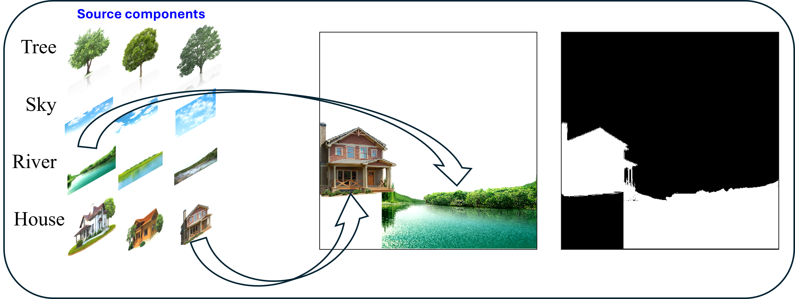

# Advance-IPainter
### PyTorch implementation of Advance Intelligent Painter:

```
Hon-Man Hammond Lee, Siu Wan-Chi, Felix Ming-Fei Duan, Yi-Hao Cheng, and H. Anthony Chan. "Intelligent Picture Painting under Deep Learning with Text Enhancement," in Proc. of International Conference on Digital Signal Processing (DSP). 25-27 Jun. 2025, Costa Navarino, Messinia, Greece.
```

### About
In Advance Intelligent Painter, you could grab the source components you want and mix them together to create meaningful pictures! Such as rivers and houses shown in the example and put them into corresponding places in the composite box.

Daynight Cycle

Four Season

## Requirements

A suitable [conda](https://docs.conda.io/en/latest/) named `aipainter` can be created and activated with:

```
conda create -n aipainter python=3.11
conda activate aipainter
pip install -r requirements.txt
```

## Download weights and tokenizer files:

### Window
1. Download `vocab.json` and `merges.txt` from https://huggingface.co/stable-diffusion-v1-5/stable-diffusion-v1-5/tree/main/tokenizer and save them in the `data` folder
2. Download `v1-5-pruned-emaonly.ckpt` from https://huggingface.co/stable-diffusion-v1-5/stable-diffusion-v1-5/tree/main and save it in the `data` folder

### Linux
```
cd data
wget https://huggingface.co/stable-diffusion-v1-5/stable-diffusion-v1-5/resolve/main/tokenizer/vocab.json
wget https://huggingface.co/stable-diffusion-v1-5/stable-diffusion-v1-5/resolve/main/tokenizer/merges.txt
wget https://huggingface.co/stable-diffusion-v1-5/stable-diffusion-v1-5/resolve/main/v1-5-pruned-emaonly.ckpt
cd ..
```
## Inference
To run our model, just simply change the input_path and output_path inside the `config.yaml`
```
python demo.py --config config.yaml
```
## Special thanks

Special thanks to the following repositories:

1. https://github.com/CompVis/stable-diffusion/
1. https://github.com/divamgupta/stable-diffusion-tensorflow
1. https://github.com/kjsman/stable-diffusion-pytorch
1. https://github.com/huggingface/diffusers/
1. https://github.com/hkproj/pytorch-stable-diffusion

## Copyright

Copyright preserve by The Hong Kong Polytechnic University and Saint Francis University 
