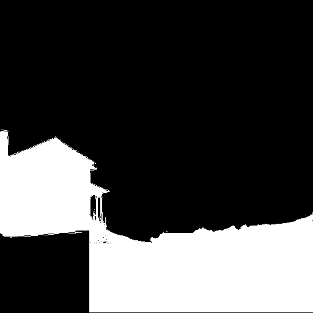
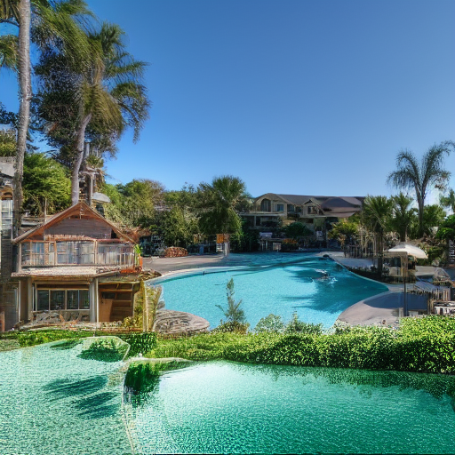
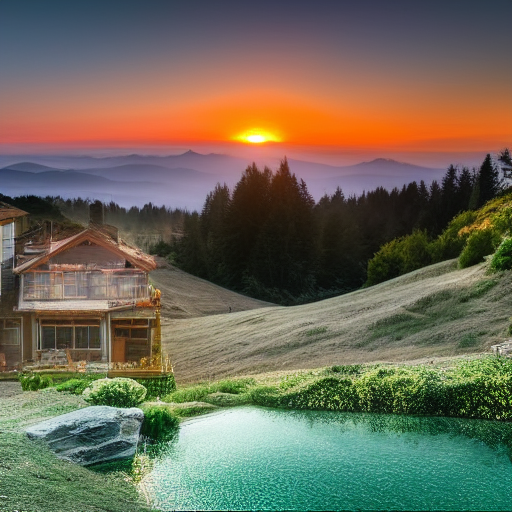
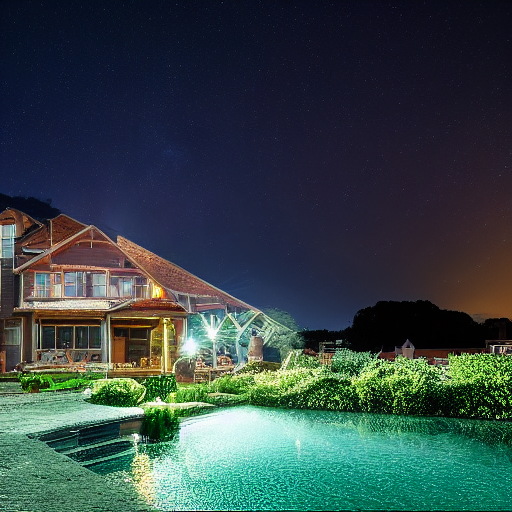

# Advance-IPainter
PyTorch implementation of Advance Intelligent Painter

With Advance-IPainter you too can also create some fantastic and meaningful pictures

Such as Daynight cycle!
 
  
## Requirements

A suitable [conda](https://docs.conda.io/en/latest/) named `aipainter` can be created and activated with:

```
conda env create -f environment.yml
conda activate aipainter
```

## Download weights and tokenizer files:

1. Download `vocab.json` and `merges.txt` from https://huggingface.co/stable-diffusion-v1-5/stable-diffusion-v1-5/tree/main/tokenizer and save them in the `data` folder
2. Download `v1-5-pruned-emaonly.ckpt` from https://huggingface.co/stable-diffusion-v1-5/stable-diffusion-v1-5/tree/main and save it in the `data` folder

## Test:


## Special thanks

Special thanks to the following repositories:

1. https://github.com/CompVis/stable-diffusion/
1. https://github.com/divamgupta/stable-diffusion-tensorflow
1. https://github.com/kjsman/stable-diffusion-pytorch
1. https://github.com/huggingface/diffusers/
1. https://github.com/hkproj/pytorch-stable-diffusion
